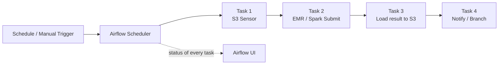
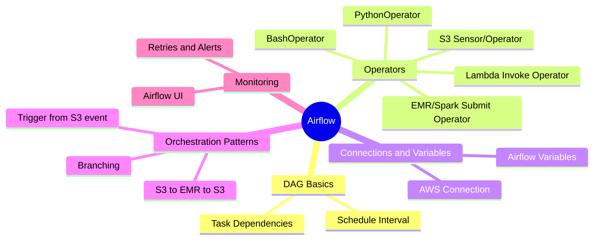

## AWS Airflow Operations

### What is Airflow?
Apache Airflow (offered as a managed service on AWS called MWAA - Managed Workflows for
Apache Airflow) is a workflow **scheduler**. You describe a pipeline as Python code - a
**DAG** (Directed Acyclic Graph) of tasks and the order they must run in - and Airflow
runs it on schedule, retries failed tasks, and shows you a UI with every run's status.
Think of it as cron, but with dependencies between steps, retries, and visibility.

### How data flows

### Mind map

### What we'll build
* DAG Basics
    * Write a simple DAG
    * Schedule Interval / Cron
    * Task Dependencies (>>, <<)
* Operators
    * PythonOperator
    * BashOperator
    * S3 Sensor / S3 Operators
    * Lambda Invoke Operator
    * EMR / Spark Submit Operator
* Connections & Variables
    * AWS Connection setup (pointing at the floci profile)
    * Airflow Variables and Connections via CLI
* Orchestration Patterns
    * ETL pipeline: S3 -> EMR/PySpark -> S3
    * Trigger a DAG from an S3 event
    * Branching (BranchPythonOperator)
* Monitoring
    * Airflow UI - DAG runs, task logs
    * Retries and alerting on failure
