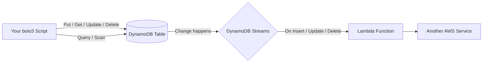
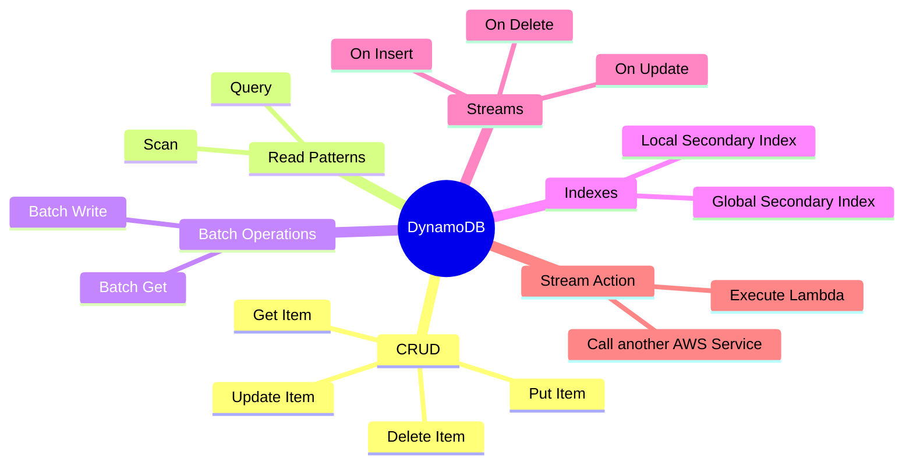

## AWS Dynamo DB

### What is DynamoDB?
Amazon DynamoDB is a fully managed **NoSQL** database - there are no fixed columns to
define upfront and no servers to patch. You store **items** (think: JSON documents)
inside **tables**, and every item is identified by a **partition key** (and, optionally,
a **sort key**). It's built for very fast key-based lookups at any scale, and it can
also **stream** every change (insert/update/delete) out to other services in real time.

### How data flows

### Mind map

### What we'll build
* Write boto3 client programs for
    * Create Table
    * Delete Table
    * List all Tables
    * Describe Table (schema, indexes, throughput)
    * Put Item
    * Get Item
    * Update Item
    * Delete Item
    * Query (partition key + sort key, filters)
    * Scan (with filters, pagination)
* Batch Operations
    * Batch Write Item
    * Batch Get Item
* Indexes
    * Global Secondary Index (GSI)
    * Local Secondary Index (LSI)
* Streams
    * Enable DynamoDB Streams
    * On Insert
    * On Update
    * On Delete
* Stream Action
    * Execute Lambda
    * Call some other AWS Service
