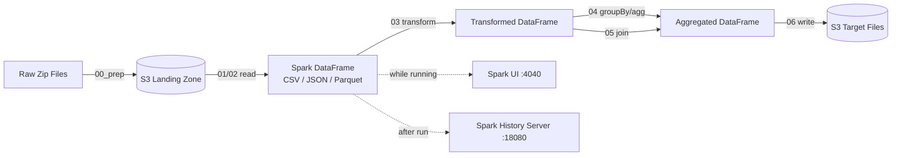
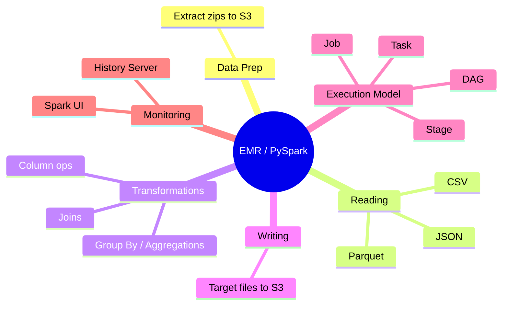

## AWS EMR / PySpark Operations

### What is EMR?
Amazon EMR (Elastic MapReduce) is AWS's managed big-data cluster service for running
distributed processing frameworks like Apache Spark, Hadoop and Hive across many
machines at once - useful when a dataset is too big (or too slow) to process on a single
machine. Real EMR clusters cost money by the hour, so this module runs the exact same
PySpark code against a local Docker Spark cluster (started by [on-boarding](../on-boarding/README.md))
instead - the DataFrame code, and the DAG/Job/Stage/Task execution model, are identical
to what you'd use on real EMR.

### How data flows

### Mind map

### What we'll build
* Data Prep
    * Extract sample zip data into the S3 landing zone ([00_prep_extract_zips_to_s3.py](00_prep_extract_zips_to_s3.py))
* Reading Data
    * Read CSV files ([01_read_csv_basics.py](01_read_csv_basics.py))
    * Read JSON and Parquet files ([02_read_json_and_parquet.py](02_read_json_and_parquet.py))
* Transformations
    * Column/DataFrame transformations ([03_transformations.py](03_transformations.py))
    * Group By and Aggregations ([04_groupby_aggregations.py](04_groupby_aggregations.py))
    * Joins ([05_joins.py](05_joins.py))
* Writing Data
    * Write target files back to S3 ([06_write_target_files.py](06_write_target_files.py))
* Understanding Spark Execution
    * Spark Application = ETL Script
    * DAG -> Job -> Stage -> Task breakdown (see [to-do.md](to-do.md))
    * Reading the Spark UI and event log ([pyspark-code/understanding-pyspark-execution/understanding-pyspark-eventlog.md](pyspark-code/understanding-pyspark-execution/understanding-pyspark-eventlog.md))
* Running Lessons
    * See [run-commands.md](run-commands.md) for spark-submit commands, UI links, and the python3-vs-spark-submit gotcha
