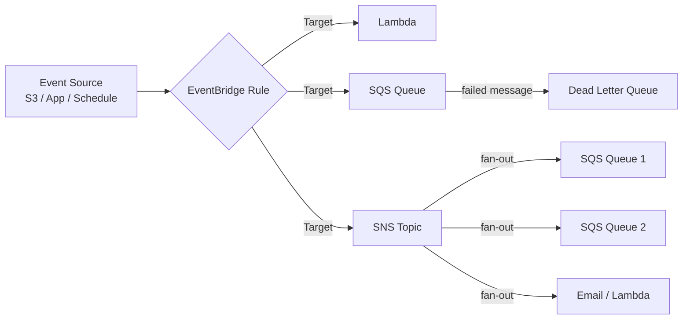
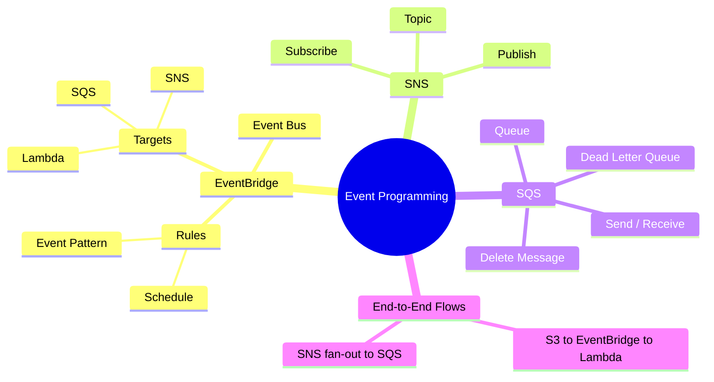

## AWS Event Programming

### What are EventBridge, SNS and SQS?
These three services are AWS's "glue" for event-driven architectures - they let one
part of your system tell other parts that something happened, without those parts
knowing about each other directly.
* **EventBridge** is an event router/bus: it watches for events (custom, scheduled, or
  from other AWS services), matches them against **rules**, and forwards matches to one
  or more **targets**.
* **SNS** (Simple Notification Service) is pub/sub messaging: one message published to a
  **topic** can fan out to many subscribers at once (email, SQS, Lambda).
* **SQS** (Simple Queue Service) is a message **queue**: a message sits there until a
  consumer picks it up and processes it, which decouples a fast producer from a slower
  consumer and survives the consumer being briefly down.

### How data flows

### Mind map

### What we'll build
* EventBridge (CloudWatch Events)
    * Write boto3 client programs for
        * Create Event Bus
        * Put Rule
        * Put Targets
        * Put Events (custom events)
        * List Rules / Targets
        * Delete Rule / Targets
    * Rule Patterns
        * Schedule Rules (cron/rate expressions)
        * Event Pattern Matching (source, detail-type, detail)
    * Targets
        * Invoke Lambda
        * Send to SQS
        * Send to SNS
* SNS (Simple Notification Service)
    * Create Topic
    * Subscribe (email, SQS, Lambda)
    * Publish Message
    * Delete Topic
* SQS (Simple Queue Service)
    * Create Queue
    * Send Message
    * Receive Message
    * Delete Message
    * Dead Letter Queue setup
* End-to-End Event Flow
    * S3 event -> EventBridge -> Lambda
    * SNS fan-out to multiple SQS queues
