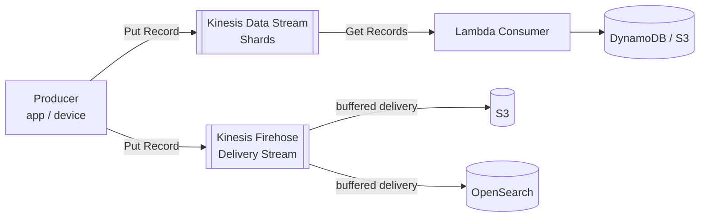
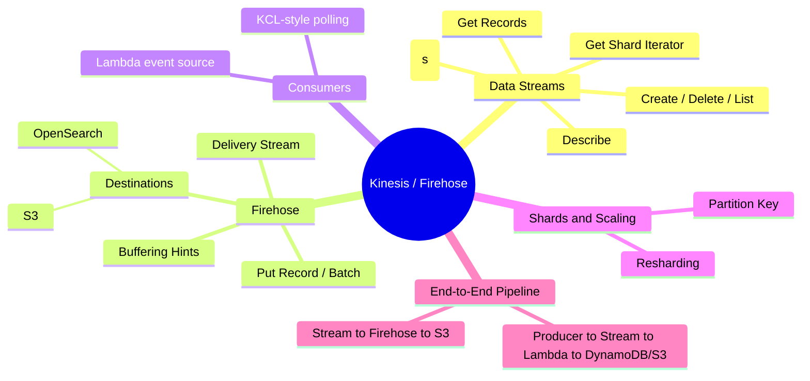

## AWS Kinesis/Firehose

### What is Kinesis?
Amazon Kinesis is AWS's real-time streaming data service. Instead of files landing in S3
in batches, Kinesis lets producers push a continuous stream of small records (clicks,
sensor readings, logs) that consumers can read almost instantly.
* **Kinesis Data Streams** is the raw, low-level stream: you own the **shards**
  (partitions of throughput) and write your own consumer.
* **Kinesis Data Firehose** is a simpler "fire and forget" pipe: you point it at a
  destination (S3, OpenSearch) and it buffers and delivers the data for you - no shards
  or consumer code to manage.

### How data flows

### Mind map

### What we'll build
* Kinesis Data Streams
    * Write boto3 client programs for
        * Create Stream
        * Delete Stream
        * List Streams
        * Describe Stream
        * Put Record
        * Put Records (batch)
        * Get Shard Iterator
        * Get Records
* Kinesis Data Firehose
    * Create Delivery Stream
    * Put Record / Put Record Batch
    * Delivery Stream Destinations
        * S3
        * OpenSearch
    * Buffering hints (size/interval) and format conversion
* Consumers
    * Lambda as a stream consumer (event source mapping)
    * KCL-style polling consumer with boto3
* Shards & Scaling
    * Resharding (split/merge shards)
    * Partition Key strategy
* End-to-End Pipeline
    * Producer -> Kinesis Stream -> Lambda -> DynamoDB/S3
    * Kinesis Stream -> Firehose -> S3
