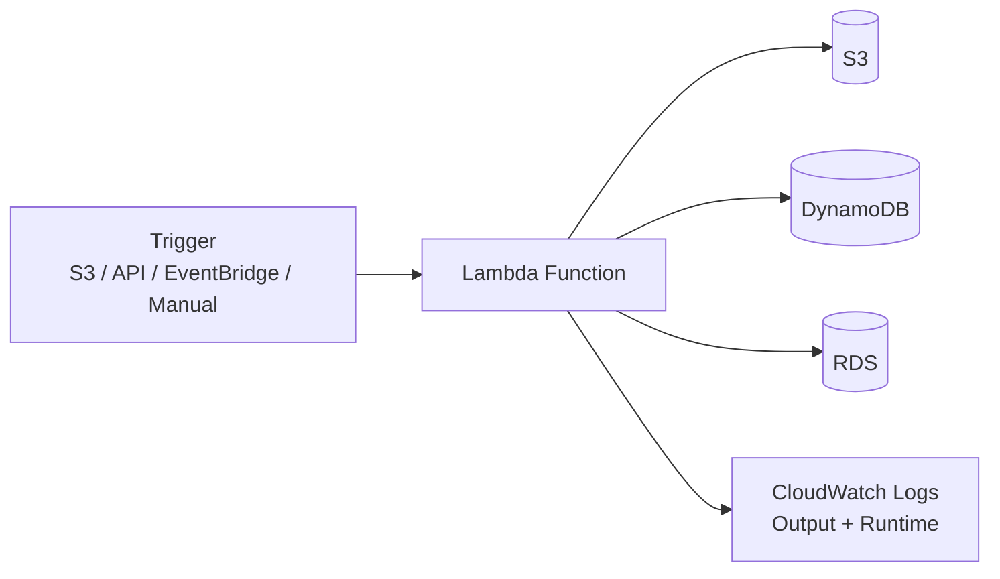
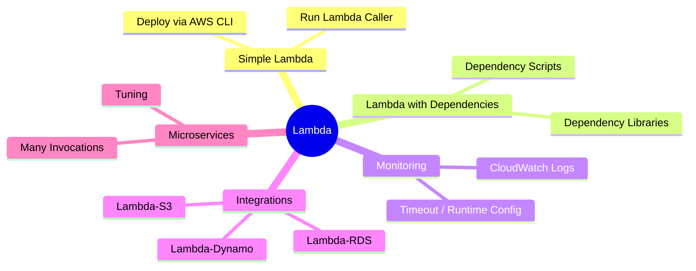

## AWS Lambda Operations

### What is Lambda?
AWS Lambda is a "serverless" compute service. Instead of renting and managing a server,
you upload a small piece of code (a **function**) and AWS runs it for you only when
something **triggers** it - an S3 event, an API call, a schedule, or a manual invoke.
You pay only for the milliseconds your code actually runs, and AWS scales it up
automatically if 1,000 triggers arrive at once.

### How data flows

### Mind map

### What we'll build
* Create a Simple Lambda
  * Deploy Lambda (using AWS CLI)
  * Run Lambda Caller
* Create a Lambda with dependancy Libraries and dependancy python scripts
  * Deploy Lambda (using AWS CLI)
  * Run Lambda Caller
* Monitor the CloudWatch to see output and runtime
* Manage Lambda TimeOut Run time
* Lambda-S3 Operations
  * Deploy Lambda (using AWS CLI)
  * Run Lambda Caller
* Lambda-RDS Operations
  * Deploy Lambda (using AWS CLI)
  * Run Lambda Caller
* Lambda-Dynamo Operations
  * Deploy Lambda (using AWS CLI)
  * Run Lambda Caller
* Lambda Micro Services
  * Deploy Lambda (using AWS CLI)
  * Run Lambda Caller
  * Calling a Lambda lot of times and tuning
