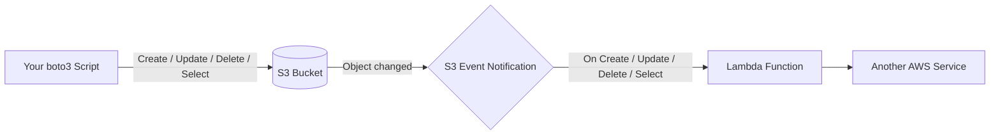
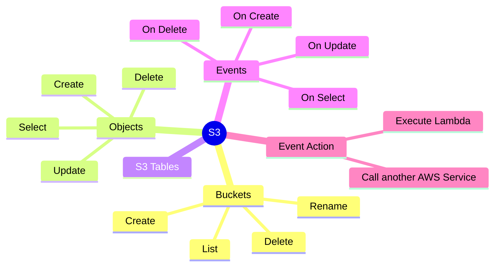

## AWS S3 Operations

### What is S3?
Amazon S3 (Simple Storage Service) is AWS's object storage service. Think of it as an
infinite cloud folder: you create **buckets** (top-level containers) and drop **objects**
(files) into them, each identified by a unique **key** (its path/name). There's no
filesystem to mount - everything is read/written over HTTP using the AWS CLI or an SDK
like boto3. S3 can also **notify** other AWS services automatically whenever something
happens to an object (created, updated, deleted).

### How data flows

### Mind map

### What we'll build
* Write boto3 client programs for
    * Create Bucket
    * Rename Bucket
    * Delete Bucket
    * List all Buckets
    * List all Folders/Files in a Bucket
    * Create Object
    * Update Object
    * Delete Object
    * Select Object
* S3 Tables
* Events
    * On Create Object
    * On Update Object
    * On Delete Object
    * On Select Object
* Event Action
    * Execute Lambda
    * Call some other AWS Service  
