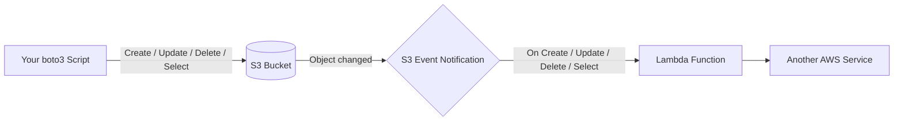
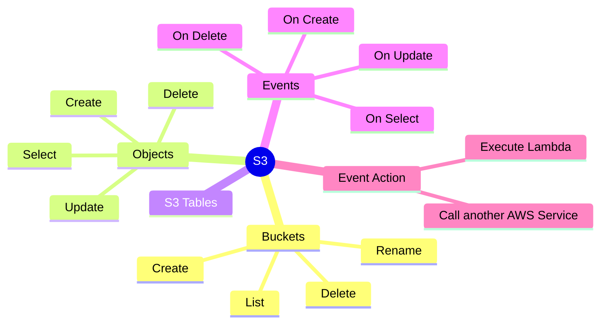

## AWS S3 Operations

### What is S3?
Amazon S3 (Simple Storage Service) is AWS's object storage service. Think of it as an
infinite cloud folder: you create **buckets** (top-level containers) and drop **objects**
(files) into them, each identified by a unique **key** (its path/name). There's no
filesystem to mount - everything is read/written over HTTP using the AWS CLI or an SDK
like boto3. S3 can also **notify** other AWS services automatically whenever something
happens to an object (created, updated, deleted).

### How data flows


### Mind map


### What we'll build
* Write boto3 client programs for
    * Create Bucket
    * Rename Bucket
    * Delete Bucket
    * List all Buckets
    * List all Folders/Files in a Bucket
    * Create Object
    * Update Object
    * Delete Object
    * Select Object
* S3 Tables
* Events
    * On Create Object
    * On Update Object
    * On Delete Object
    * On Select Object
* Event Action
    * Execute Lambda
    * Call some other AWS Service  

### Boto3 programs for Floci AWS

The programs in this folder use the `floci` AWS profile and connect to the local
S3 endpoint at `http://localhost:4566`. Before running them, start the local stack
and create the profile:

```powershell
cd on-boarding
docker compose --env-file settings.config up -d floci-aws
.\setup-floci-profile.ps1

cd ..\aws-s3-operations
python -m pip install -r requirements.txt
```

The defaults can be overridden with `FLOCI_AWS_PROFILE`, `FLOCI_ENDPOINT_URL`,
and `FLOCI_AWS_REGION` environment variables.

#### Bucket operations

```powershell
# Create a bucket
python 01_create_bucket.py training-source

# Rename a bucket. S3 has no native rename operation, so this creates the new
# bucket, copies every object, and deletes the original bucket after all copies succeed.
python 02_rename_bucket.py training-source training-renamed

# Delete an empty bucket
python 03_delete_bucket.py training-renamed

# Delete a bucket and all of its objects, versions, and delete markers
python 03_delete_bucket.py training-renamed --force

# List all buckets
python 04_list_buckets.py
```

#### Object operations

S3 folders are virtual. A key ending in `/` is displayed as `FOLDER`; every other
key is displayed as `FILE`.

```powershell
# List every folder/file, or only keys under a prefix
python 05_list_bucket_contents.py training-source
python 05_list_bucket_contents.py training-source --prefix incoming/

# Create an object from text or a local file
python 06_create_object.py training-source incoming/hello.txt --text "Hello Floci"
python 06_create_object.py training-source incoming/data.csv --file .\data.csv

# Update an existing object
python 07_update_object.py training-source incoming/hello.txt --text "Updated text"

# Read an object to the terminal or download it
python 09_select_object.py training-source incoming/hello.txt
python 09_select_object.py training-source incoming/data.csv --output .\downloaded-data.csv

# Delete an object
python 08_delete_object.py training-source incoming/hello.txt
```

`Select Object` here means retrieving an object with boto3 `get_object`. It does
not mean the separate S3 Select SQL-expression API.
