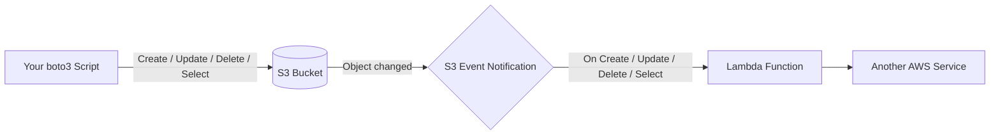
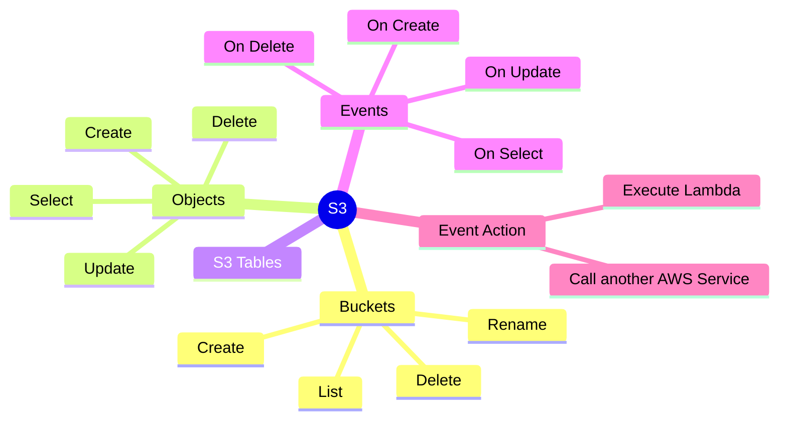
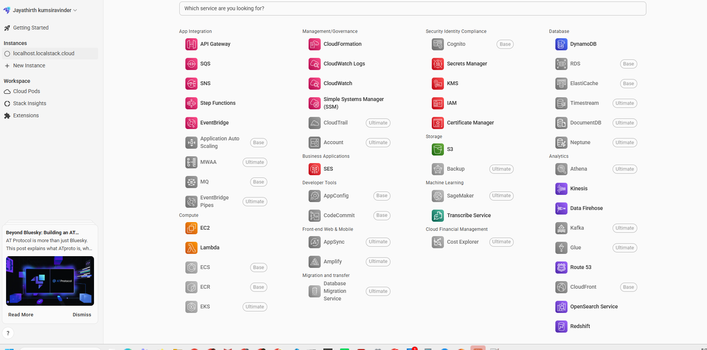

## AWS S3 Operations

### What is S3?
Amazon S3 (Simple Storage Service) is AWS's object storage service. Think of it as an
infinite cloud folder: you create **buckets** (top-level containers) and drop **objects**
(files) into them, each identified by a unique **key** (its path/name). There's no
filesystem to mount - everything is read/written over HTTP using the AWS CLI or an SDK
like boto3. S3 can also **notify** other AWS services automatically whenever something
happens to an object (created, updated, deleted).

### How data flows


### Mind map


### What we'll build
* Write boto3 client programs for
    * Create Bucket
    * Rename Bucket
    * Delete Bucket
    * List all Buckets
    * List all Folders/Files in a Bucket
    * Create Object
    * Update Object
    * Delete Object
    * Select Object
* S3 Tables
* Events
    * On Create Object
    * On Update Object
    * On Delete Object
    * On Select Object
* Event Action
    * Execute Lambda
    * Call some other AWS Service  

### Boto3 programs for Floci AWS

The programs in the `scripts` folder use the `floci` AWS profile and connect to
the local S3 endpoint at `http://localhost:4566`. Complete the
[AWS local setup guide](../on-boarding/README.md) first. It explains LocalStack
account setup, the Hobby plan, auth-token handling, Docker startup, and Resource
Browser troubleshooting.

From the repository root, prepare the boto3 examples:

```powershell
cd C:\Code\aws-masterclass\on-boarding
docker compose --env-file settings.config up -d floci-aws
.\setup-floci-profile.ps1

cd ..\aws-s3-operations
python -m pip install -r requirements.txt
```

The defaults can be overridden with `FLOCI_AWS_PROFILE`, `FLOCI_ENDPOINT_URL`,
and `FLOCI_AWS_REGION` environment variables.

#### First student exercise

Run these commands in order from `C:\Code\aws-masterclass\aws-s3-operations`:

```powershell
# 1. Create a bucket
python scripts\01_create_bucket.py student-training-bucket

# 2. Confirm that it exists
python scripts\04_list_buckets.py

# 3. Create an object
python scripts\06_create_object.py student-training-bucket folder/hello.txt --text "Hello Floci AWS"

# 4. List the inferred folder and file
python scripts\05_list_bucket_contents.py student-training-bucket

# 5. Read the object
python scripts\09_select_object.py student-training-bucket folder/hello.txt

# 6. Update and read it again
python scripts\07_update_object.py student-training-bucket folder/hello.txt --text "Updated content"
python scripts\09_select_object.py student-training-bucket folder/hello.txt

# 7. Delete the object and bucket
python scripts\08_delete_object.py student-training-bucket folder/hello.txt
python scripts\03_delete_bucket.py student-training-bucket
```

To observe each operation visually, open the LocalStack Web Application, choose
**Resource Browser → S3**, select `us-east-1`, and refresh after each command.



#### Bucket operations

```powershell
# Create a bucket
python scripts\01_create_bucket.py training-source

# Rename a bucket. S3 has no native rename operation, so this creates the new
# bucket, copies every object, and deletes the original bucket after all copies succeed.
python scripts\02_rename_bucket.py training-source training-renamed

# Delete an empty bucket
python scripts\03_delete_bucket.py training-renamed

# Delete a bucket and all of its objects, versions, and delete markers
python scripts\03_delete_bucket.py training-renamed --force

# List all buckets
python scripts\04_list_buckets.py
```

#### Object operations

S3 folders are virtual. The listing program infers folders from `/` characters in
object keys and displays every non-folder object as `FILE`.

```powershell
# List every folder/file, or only keys under a prefix
python scripts\05_list_bucket_contents.py training-source
python scripts\05_list_bucket_contents.py training-source --prefix incoming/

# Create an object from text or a local file
python scripts\06_create_object.py training-source incoming/hello.txt --text "Hello Floci"
python scripts\06_create_object.py training-source incoming/data.csv --file .\data.csv

# Update an existing object
python scripts\07_update_object.py training-source incoming/hello.txt --text "Updated text"

# Read an object to the terminal or download it
python scripts\09_select_object.py training-source incoming/hello.txt
python scripts\09_select_object.py training-source incoming/data.csv --output .\downloaded-data.csv

# Delete an object
python scripts\08_delete_object.py training-source incoming/hello.txt
```

`Select Object` here means retrieving an object with boto3 `get_object`. It does
not mean the separate S3 Select SQL-expression API.

### Common errors

- **`The config profile (floci) could not be found`**: run
  `on-boarding\setup-floci-profile.ps1`, then retry.
- **Connection refused at port 4566**: start Docker Desktop and run
  `docker compose --env-file settings.config up -d floci-aws` from `on-boarding`.
- **Missing `FLOCI_AUTH_TOKEN`**: set the token in the terminal by following
  step 4 of the [local setup guide](../on-boarding/README.md).
- **Bucket already exists**: choose a different lowercase bucket name, or delete
  the existing training bucket first.
- **Bucket is not empty**: delete its objects first, or use
  `python scripts\03_delete_bucket.py <bucket> --force`.
- **The bucket is visible in boto3 but not in the UI**: select region `us-east-1`
  in the Resource Browser and refresh it.
- **`localhost:4566` is blank in a browser**: this is expected because `4566`
  is the AWS API endpoint, not a dashboard. Use the LocalStack Web Application.
