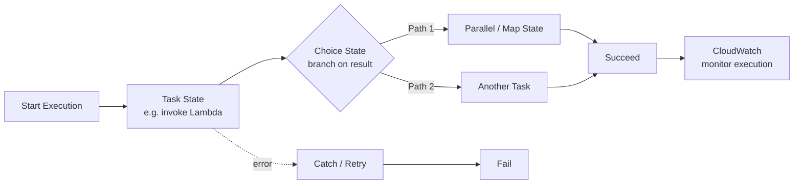
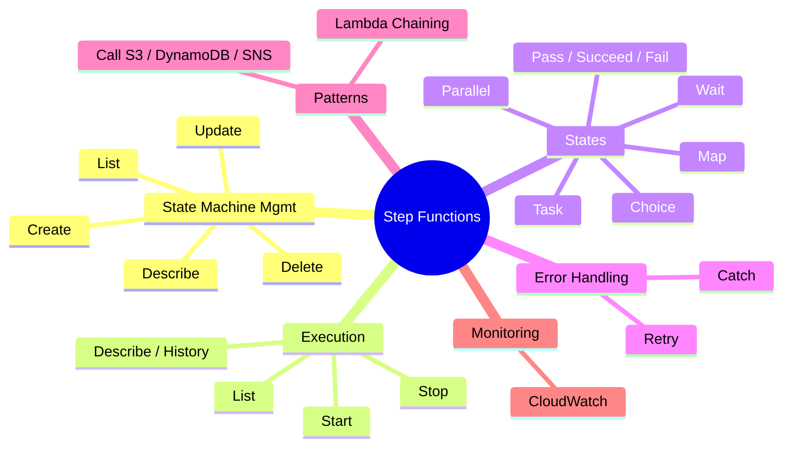

## AWS Step Function Operations

### What is Step Functions?
AWS Step Functions lets you orchestrate several steps (often several Lambda functions,
plus other AWS services) into one visual workflow called a **state machine**. Instead of
one Lambda calling the next in code, Step Functions decides the order, retries steps
that fail, branches based on conditions, and shows you exactly which step succeeded or
failed - like a flowchart that actually runs.

### How data flows

### Mind map

### What we'll build
* Write boto3 client programs for
    * Create State Machine
    * Update State Machine
    * Delete State Machine
    * List all State Machines
    * Describe State Machine
    * Start Execution
    * Stop Execution
    * List Executions
    * Describe Execution / Get Execution History
* State Machine Definitions (Amazon States Language)
    * Task State (invoke Lambda)
    * Choice State (branching logic)
    * Parallel State
    * Map State (iterate over a collection)
    * Wait State
    * Pass / Succeed / Fail States
* Error Handling
    * Retry
    * Catch
* Orchestration Patterns
    * Lambda chaining via Step Functions
    * Step Function calling S3 / DynamoDB / SNS
* Monitor via CloudWatch
    * Execution status, duration, failures
